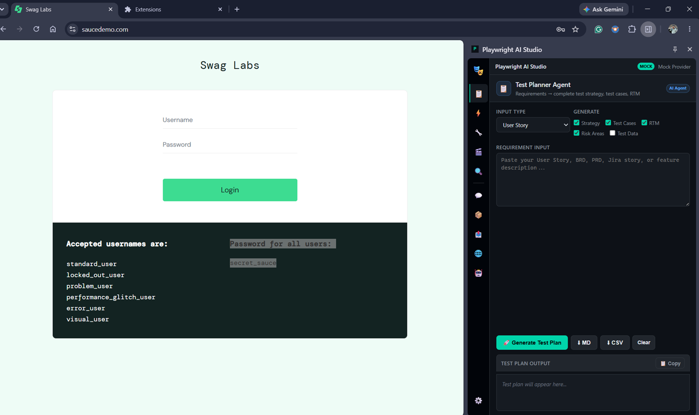
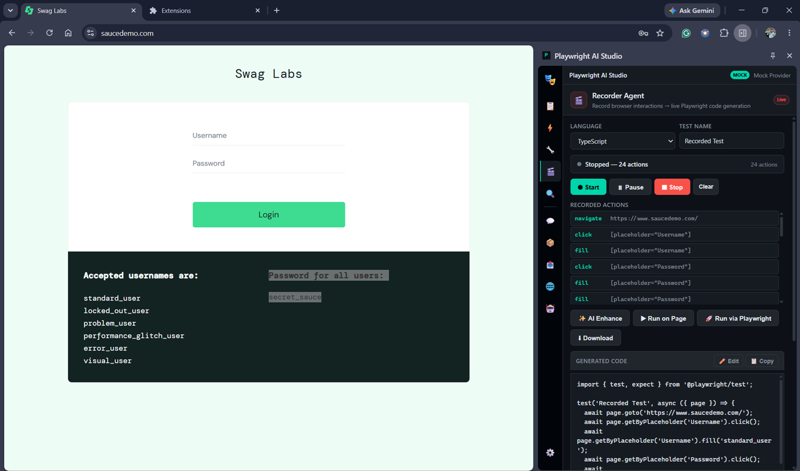
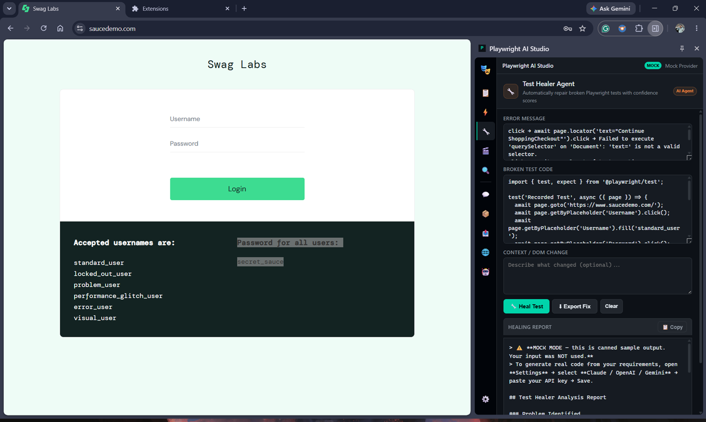
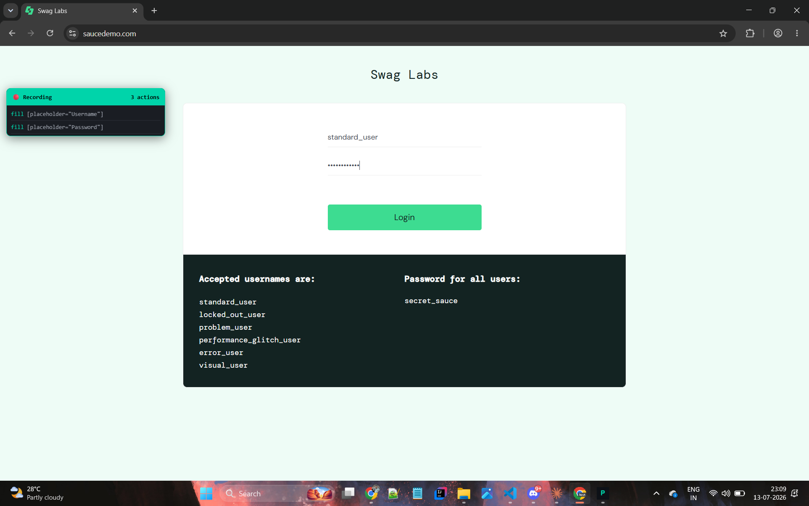
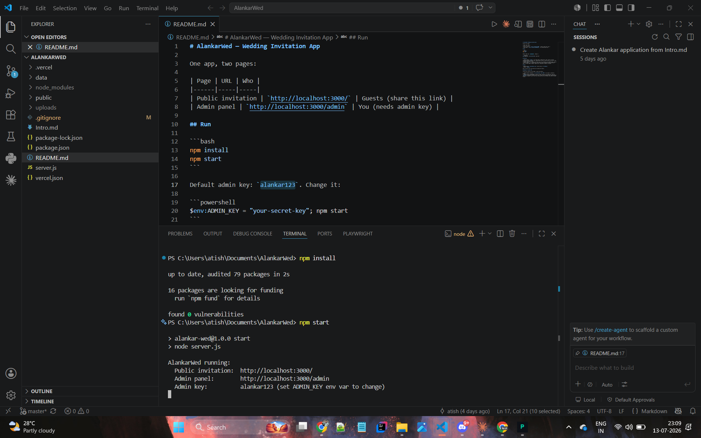

# Playwright AI Studio

AI-powered Playwright QA suite: a Chrome extension with in-browser AI test agents, a local Bridge for real Playwright runs, and a standalone multi-agent Orchestrator CLI.

## Problem Statement

Manual QA is slow to plan and script, and locator-based Playwright suites break the moment the DOM changes. AI coding tools live outside the browser, disconnected from the actual page under test, so fixing a broken selector still means tabbing away, inspecting the DOM by hand, and copy-pasting a patch back into the suite.

## Solution

Playwright AI Studio puts the AI agents inside the browser instead of next to it:

- **Chrome extension** ("Playwright AI Studio") — a side panel with Planner, Generator, Healer, Recorder, Inspector, Chat, Framework, Export, and Session agents that read the live page and generate/repair real Playwright code in place.
- **Bridge** — a local WebSocket server that runs the generated code as a real headed `npx playwright test`, and proxies LLM calls to the Claude Code CLI.
- **Orchestrator** (`pworch`) — a standalone 15-agent CLI for full plan → generate → execute → heal pipelines, usable independently of the extension.

## Tech Stack

| Component | Stack |
|---|---|
| `PlaywrightExtension/` | Vanilla JS, Chrome MV3, no build step |
| `PlaywrightBridge/` | Node.js (ESM), `ws`, `@playwright/test`, spawns Claude Code CLI |
| `PlaywrightOrchestrator/` | TypeScript, ts-node, Commander, `@playwright/test`, `@axe-core/playwright`, winston |
| `landing/` | Static HTML/CSS/JS, deployed on Vercel |

## How to Run

### Extension
No build. Load unpacked:
1. Open `chrome://extensions`
2. Enable Developer mode
3. **Load unpacked** → select `PlaywrightExtension/`
4. Reload the extension card after any edit to `background.js` or the side panel

### Bridge (real Playwright runs + Claude Code CLI as LLM)
```bash
cd PlaywrightBridge
npm run setup   # npm install + npx playwright install chromium (once)
npm start       # ws://127.0.0.1:8787
```

### Orchestrator CLI
```bash
cd PlaywrightOrchestrator
npm install
npm run dev                  # CLI help via ts-node
npm run build                # tsc -> dist/
npm test                     # playwright test, all 5 browser projects
npx ts-node src/index.ts plan <url>
npx ts-node src/index.ts orchestrate full-cycle <url>
```

### Landing / download page
```bash
cd landing
npx serve .      # or any static file server — no build step
```
Deploy `landing/` as the Vercel project root for a hosted download page.

## Demo

Vercel: [https://playwright-ai-studio.vercel.app](https://playwright-ai-studio.vercel.app)

## Screenshots

| Test Planner | Recorder | Test Healer |
|---|---|---|
|  |  |  |

| Recording a login flow | Generated script |
|---|---|
|  |  |
